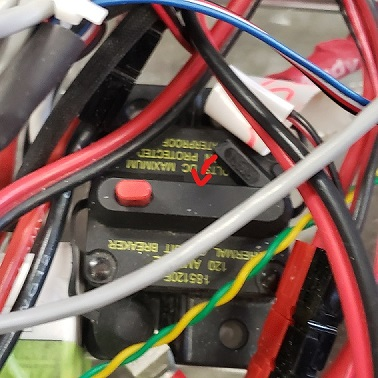
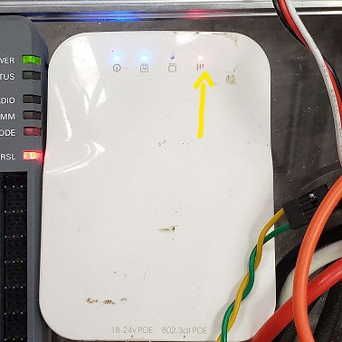
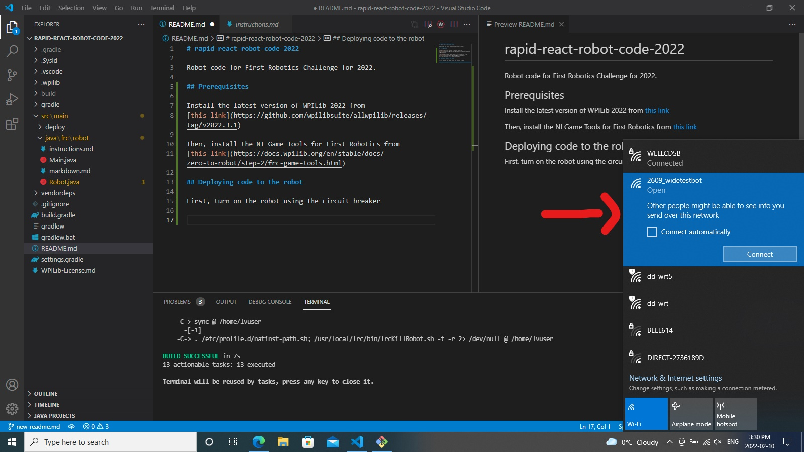

## How To Use The Robot
**ATTENTION:** Open this file in a markdown (`.md`) file reader for better formatting (especially the table of controls).
* WPILib VS Code can be used for this purpose. Press the book icon with the magnifying glass in the top right to view the formatted file.

## Setup
Turn on the robot using the circuit breaker:

Wait until the router light turns yellow (it will take about a minute):

Go to Wi-Fi settings and connect to "2609_BrunoBars":

## Configuration
* All of the below variables are located in `src\main\java\frc\robot\Constants.java`.
* Longitudinal speed (forward/backward):
  * Modify `Constants.Drive.LONGITUDINAL_SPEED_MULTIPLIER`
* Turning speed (left/right):
  * Modify `Constants.Drive.TURNING_SPEED_MULTIPLIER`
* Overall speed:
  * Modify `Constants.Drive.OVERALL_SPEED_MULTIPLIER`

## Controls
| Control            | Operation |
| ------------------ | --------- |
| Left Stick Y Axis  | Drive forward/back |
| Right Stick X Axis | Turn left/right |
| Left Trigger       | Turn turret left |
| Right Trigger      | Turn turret right |
| DPAD Up            | Increase shooter RPM |
| DPAD Down          | Decrease shooter RPM |
| Left Bumper        | (While held) Retract intake |
| Right Bumper       | (While held) Extend intake |
| A Button           | (While held) Intake ball |
| B Button           | (While held) Feed balls to shooter |
| X Button           | (While held) Outtake ball |
| Y Button           | (While held) Remove balls from shooter |
| Start Button       | (Toggle) Enable/disable shooter |
