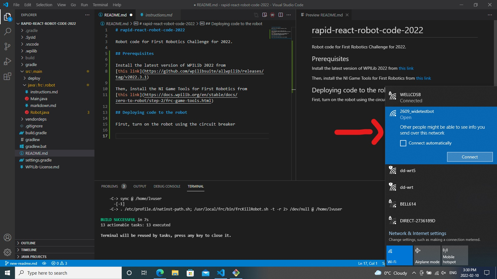
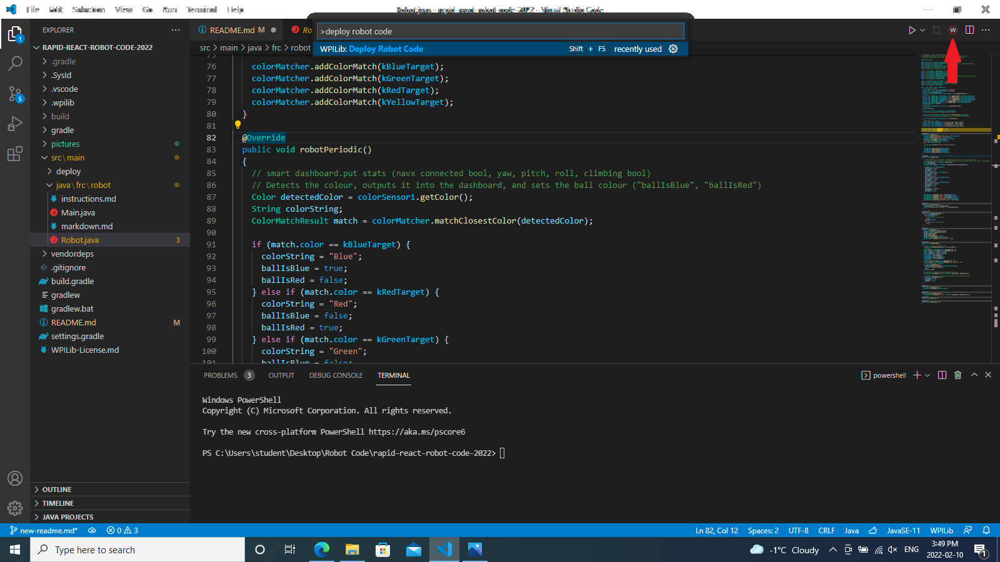

# rapid-react-robot-code-2022

Robot code for First Robotics Challenge for 2022.

The `pictures` folder is for the embedded photos. Don't delete it.

## Prerequisites

Install the latest version of WPILib 2022 from
[this link](https://github.com/wpilibsuite/allwpilib/releases/tag/v2022.3.1)

Then, install the NI Game Tools for First Robotics from
[this link](https://docs.wpilib.org/en/stable/docs/zero-to-robot/step-2/frc-game-tools.html)

## Deploying code to the robot

First, turn on the robot using the circuit breaker:

Wait until the router light turns yellow (it will take about a minute)

Next, go to Wi-Fi settings and connect to "2609_BrunoBars"

After that, press `CTRL+SHIFT+P` or press the WPILib button in the top right corner and type "Deploy Robot Code", then press enter.

If you get an error saying `BUILD FAILED in Xs`, you are probably not connected to the robot. Scroll up in the console.

If you see something along the lines of `Are you connected to the robot, and is it on?` You are likely not connected to the robot's Wi-Fi network.

If you get a message saying `BUILD SUCCESSFUL in Xs`, your code is now deployed to the robot and ready to be used.

